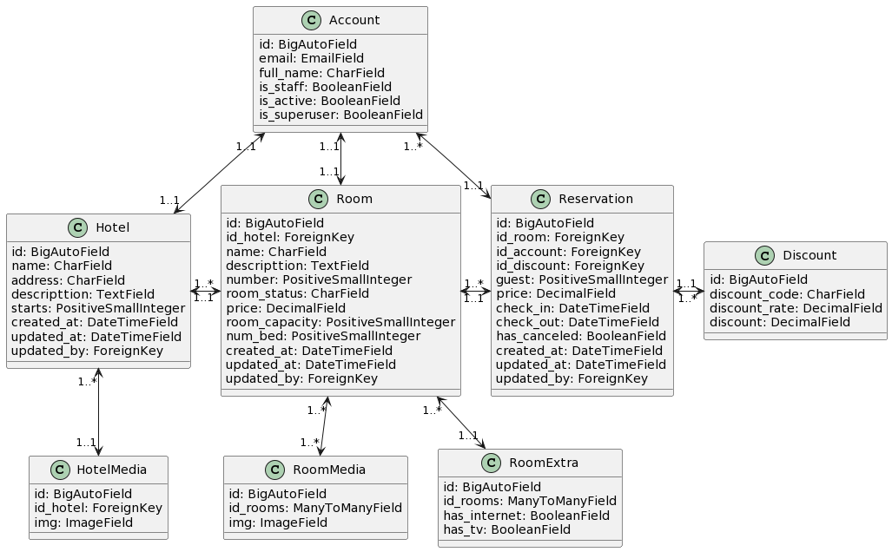

# HOTEL SOLUTIONS   

API-Rest for the management of hotel rooms and reservations.

In this project, no third-party libraries or dependencies will be used to facilitate certain solutions, such as `django-simple-history` for a log record system or `django-storages` for storing different files. 

For controlling the application in various views, the `is_staff` and `is_superuser` fields of the Account model will be used, temporarily setting aside the permissions and access provided by Django itself.


---
## Applications
- [Account](#account)
- [Hotel](#hotel)

### Account
Manages the records of various users throughout the project in the database, as well as the different methods this application may need to work with the records.

### Hotel
Store the various hotel and room records along with their information, including media content, in a database using the different methods that this application may require.

## UML
**NOTE:** Please note that this is a simplified representation, and actual models might be more complex depending on your application's requirements. You can inspect the database schema generated by running `makemigrations` and `migrate` commands to see the exact table names and relationships in a real Django project.



## Deploy

### Development environment
Update the `.env.template` file with your environment variables.

Run the next command.
```bash
docker-compose --env-file .env.template up -d 
```