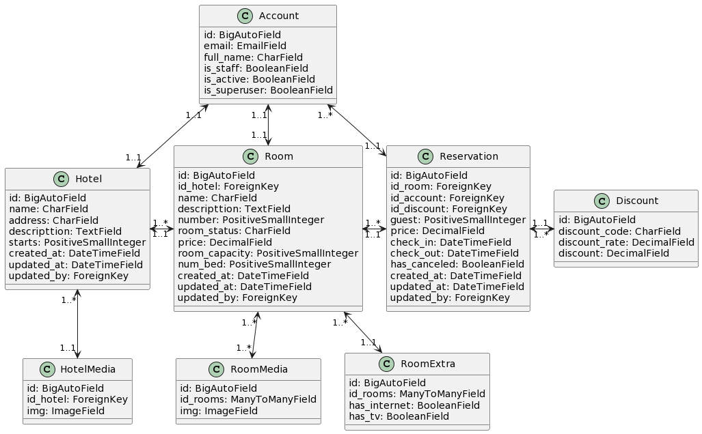

# HOTEL SOLUTIONS   

API-Rest para la administración de habitaciones y reservas de un hotel.

En este proyecto no se utilizaran librerías ni dependencias de terceros que faciliten ciertas soluciones como puede ser `django-simple-history` para sistema de bitácora de registros o `django-storages` para el almacenamiento de los diferentes archivos. 

Para el control de la aplicación en las diferentes vistas se utilizaran los campos `is_staff` y `is_superuser` del modelo Account, dejando de lado por el momento los permisos y accesos que proporciona el propio Django.  


---
## Aplicaciones
- [Account](#account)
- [Hotel](#hotel)
- [Reservation](#reservation)

### Account
Lleva el registro de los diferentes usuarios de todo el servicio en BD, como los diferentes métodos que esta aplicación pueda necesitar para trabajar con los registros.

### Hotel
Almacena los diferentes registros de hoteles y habitaciones junto a su información, como contenidos media, en BD como los diferentes métodos que esta aplicación pueda necesitar.

### Reservation
Almacena los registros asociados a las reservas realizadas, vinculadas a las habitaciones y al usuario que realiza la reserva, como los diferentes métodos que esta aplicación pueda necesitar.

## UML
**NOTA:** Modelo de datos simplificado para visualizar el contenido de todos los modelos y sus campos, si necesita mas información especifica como nombre de tablas o relaciones en los casos muchos a muchos puede visualizar el contenido de la base de datos generada tras utilizar los métodos `makemigrations` y `migrate`.



## Despliegue

### Entorno de desarrollo
Actualiza el fichero `.env.template` con las variables de entorno necesarias.

Ejecuta el siguiente comando.
```bash
docker-compose --env-file .env.template up -d 
```